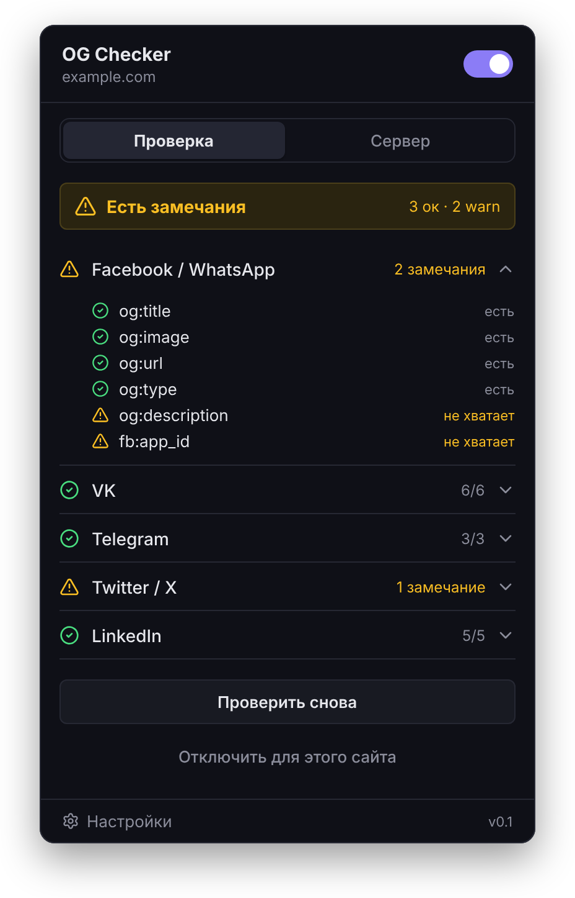
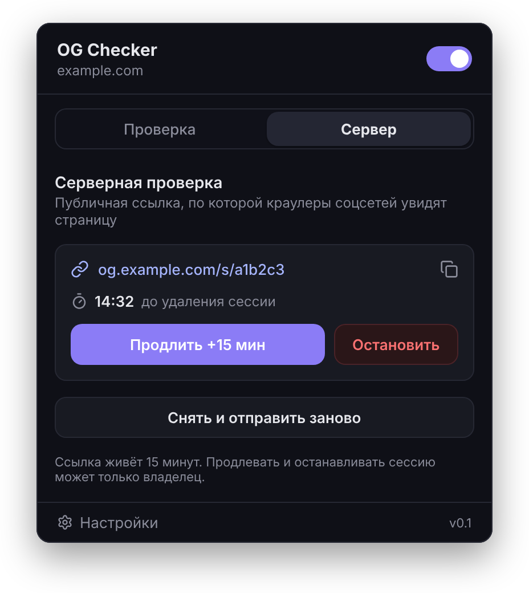

# OG Checker

*На русском — [README.ru.md](README.ru.md).*

An OpenGraph markup checker for local/staging environments (TypeScript):

- **Browser extension** (Chrome, Firefox, MV3) — local validation of OG tags against per‑social‑network profiles, with a status badge on the toolbar icon.
- **Server** (Express + Redis) — publishes a captured page at a temporary public URL so social crawlers can see it.

Detailed spec (RU) — [TZ.md](TZ.md).

## Screenshots

| Local check | Server tab |
|:---:|:---:|
|  |  |

## Structure

```
extension/   extension: TypeScript, MV3, esbuild → dist/
server/      Express server (TypeScript) + Redis; a single cjs bundle in Docker
```

## Quick start

```bash
npm install          # deps for both workspaces
npm run build        # esbuild: extension/dist/* and server/dist/index.cjs
npm run typecheck    # tsc --noEmit in both workspaces
npm test             # node:test via tsx (unit + integration)
```

### Server

```bash
docker compose up --build            # Express on :3000 + Redis  (npm run compose:up)
# or locally (needs a running Redis):
npm run dev --workspace server       # tsx watch
```

**Podman** (instead of Docker) — same config, nothing to change:

```bash
podman compose up --build            # npm run podman:up
# if no compose provider is present:  podman-compose up --build
```

Runs rootless: services talk to each other by name (`redis://redis:6379`), port `3000` is published to the host, and the image runs as a non‑privileged user (`USER node`). Stop with `npm run podman:down` (or `podman:down` / `compose:down`).

Environment variables — see [server/src/config.ts](server/src/config.ts) (`PORT`, `REDIS_URL`, `PUBLIC_BASE_URL`, limits, TTL).

### Extension

Build first: `npm run build --workspace extension` (for development — `npm run watch --workspace extension`).

**Chrome:** `chrome://extensions` → “Developer mode” → “Load unpacked” → the `extension/` folder.

**Firefox:** `about:debugging#/runtime/this-firefox` → “Load Temporary Add-on” → `extension/manifest.json`. In Firefox, host permissions are granted manually: allow site access in the add-on settings.

## How it works

### Local check

The content script collects `og:*` / `twitter:*` / `fb:*` tags and passes them to the background, which validates them against the social‑network profiles in [extension/src/lib/profiles.ts](extension/src/lib/profiles.ts) (required tags → `error`, recommended → `warning`; `og:image` reachability and dimensions are checked via fetch). The result is shown as a toolbar badge:

| Color | Meaning |
|---|---|
| grey | disabled / out of scope |
| blue | checking |
| green | all good |
| yellow | warnings |
| red | errors |

Scope: **all sites except a blacklist** (default) / **only sites in a whitelist**. Pattern — `host[:port]`, `*` is a wildcard (`*.example.com`, `localhost:3000`). The popup also has a per‑site toggle (“enable/disable on this site”).

### Server check

From a button in the popup, the extension captures the meta tags from the page's original HTML (fetched without executing JS — exactly what a crawler sees; falls back to the post‑JS DOM with a warning if the source can't be fetched), optionally uploads images (all / only externally‑unreachable / none), and sends them to the server. The server builds a synthetic preview page from the tags (no third‑party HTML is stored; values are escaped), keeps it in Redis with a 15‑minute TTL, rewrites image URLs to public ones, and returns a `/s/{id}` link. The popup shows the link and a countdown; the session can be extended or stopped — by the owner only (token/cookie).

The local check also diffs the DOM against the static HTML: tags added or changed by JS are flagged with a warning — social crawlers won't see them.

API: `POST /api/sessions`, `GET /api/sessions/:id`, `POST /api/sessions/:id/extend`, `DELETE /api/sessions/:id`; public: `GET /s/:id`, `GET /s/:id/img/:n`.

Security: the captured page is served with a strict CSP (scripts don’t execute), plus rate limiting and size limits (in config). For public deployment, serve the static content from a separate subdomain via a reverse proxy (see Stage 7 in TZ.md).

## Deployment (single domain, Caddy auto‑HTTPS)

Prerequisites on the VM: Docker (or Podman), a domain with an **A record → the VM's public IP**, and ports **80/443** open to the internet.

1. Copy env and set your domain:
   ```bash
   cp .env.example .env   # then edit DOMAIN=yourdomain.tld
   ```
2. Bring it up (Caddy + server + Redis):
   ```bash
   npm run deploy:up      # docker compose -f docker-compose.prod.yml up -d --build
   # Podman:  DOMAIN=yourdomain.tld podman compose -f docker-compose.prod.yml up -d --build
   ```

[Caddy](Caddyfile) obtains a Let's Encrypt certificate for `$DOMAIN` automatically; issued certs persist in the `caddy_data` volume. The server has no host port — it's reachable only through Caddy — and `PUBLIC_BASE_URL` is set to `https://$DOMAIN`, so `/s/{id}` links and rewritten image URLs use it. Everything on one origin: API at `/api/*`, public pages at `/s/*`.

In the extension options, set the server URL to `https://$DOMAIN`. Stop with `npm run deploy:down`.

For stronger isolation you can later split the API and the served pages onto two subdomains (`api.` / `s.`) — set `PUBLIC_BASE_URL` to the `s.` host and point the extension to the `api.` host (see Stage 7 in TZ.md). No code changes needed — the extension authenticates via the `X-Owner-Token` header.

### Usage stats (no database)

A minimal per‑day counter of created sessions is written to a JSON file (`STATS_FILE=/data/stats.json`, on the `server_data` volume) — no database. View day/week/month/total via a token‑gated endpoint:

```bash
# set ADMIN_TOKEN in .env first, then:
curl "https://$DOMAIN/admin/stats?token=$ADMIN_TOKEN"
# → {"sessions":{"day":3,"week":12,"month":40,"total":57}}
```

Without `ADMIN_TOKEN` the endpoint is disabled (404), but stats are still recorded. day/week/month are rolling windows (last 1/7/30 UTC days). You can also just read the file: `docker compose -f docker-compose.prod.yml exec server cat /data/stats.json`.

## Status

TZ.md stages 0–7 implemented in TypeScript. The UI is themed (Soft dark — popup with **Check / Server** tabs and a per‑network accordion, options page, extension icons). The server runs in production behind Caddy with automatic HTTPS on a single domain (Docker / Podman), with file‑based usage stats and search‑engine hiding (`noindex` + `robots.txt`). Optional / next: subdomain isolation of served pages (Stage 7), wider manual QA in Chrome/Firefox.

## License

MIT — see [LICENSE](LICENSE).
